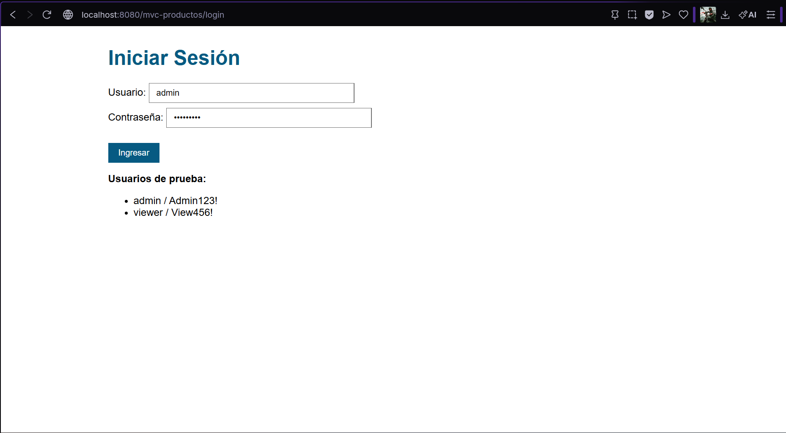
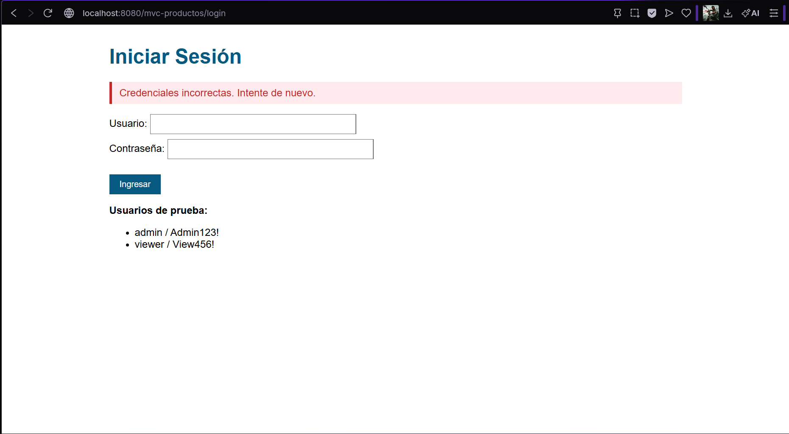
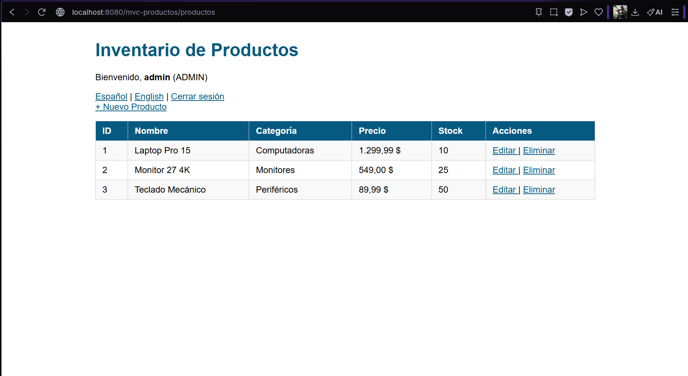
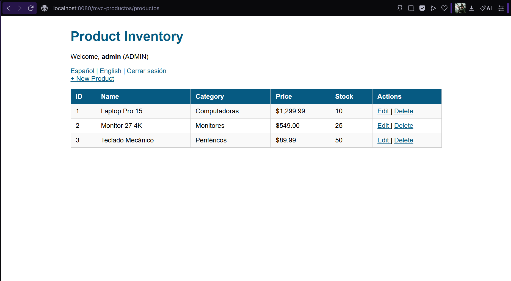
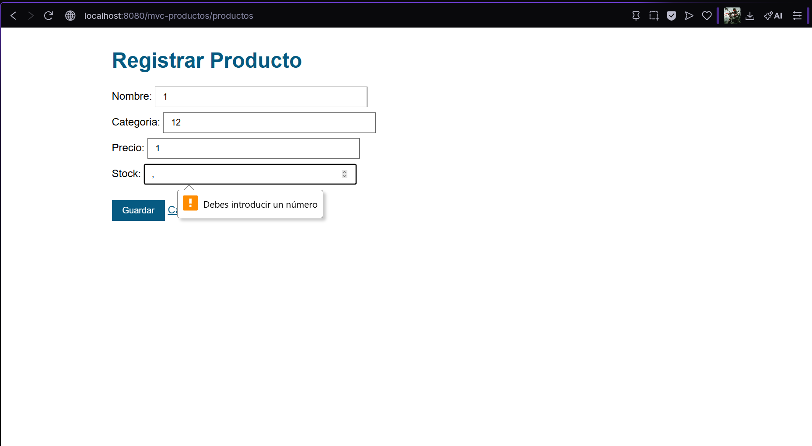
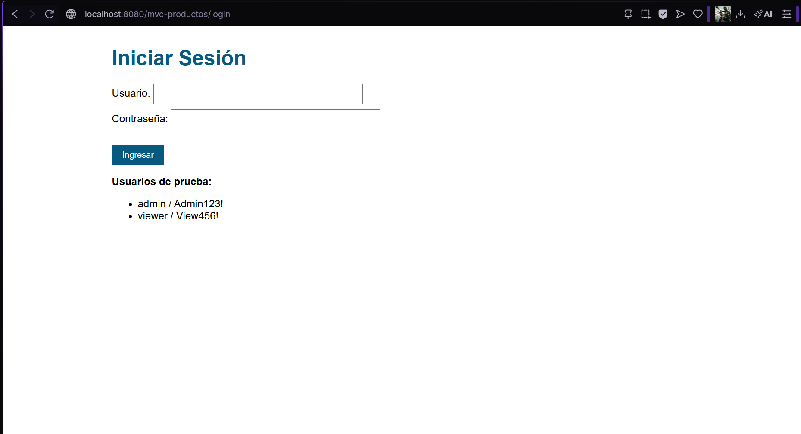

# Autenticación, Validaciones e i18n - Laboratorio JSP MVC

Extensión de la aplicación MVC del Post-Contenido 1, incorporando autenticación de usuarios con HttpSession, validaciones robustas en el servidor con retroalimentación de errores y soporte de internacionalización (i18n) para español e inglés.

## Prerrequisitos

- JDK 17 instalado y configurado en el PATH
- Apache Tomcat 10.x instalado (puerto 8080 disponible)
- IntelliJ IDEA
- Maven
- Git

## Instrucciones de ejecución

1. Clonar el repositorio:
```bash
   git clone https://github.com/Abrahan07/ProWeb-Remolina-post2-u6.git
   cd ProWeb-Remolina-post2-u6
```

2. Compilar el proyecto:
```bash
   mvn clean package
```

3. En IntelliJ IDEA ir a **Run → Edit Configurations → + → Tomcat Server → Local**, en el tab **Deployment** agregar el artefacto `war exploded` y ejecutar.

4. Acceder en el navegador:
```
   http://localhost:8080/mvc-productos/login
```

5. Usuarios de prueba:
   - `admin` / `Admin123!`
   - `viewer` / `View456!`

## Funcionalidades implementadas

- Autenticación de usuarios con HttpSession
- Protección de rutas: redirige a `/login` si no hay sesión activa
- Cierre de sesión con invalidación de sesión
- Validaciones robustas en el servidor con mensajes de error por campo
- Repoblado del formulario con los valores ingresados tras un error
- Internacionalización (i18n) para español e inglés con ResourceBundle
- Selector de idioma persistido en sesión

## Estructura del proyecto

```
mvc-productos/
├── src/main/java/com/universidad/mvc/
│   ├── model/
│   │   ├── Producto.java
│   │   ├── ProductoDAO.java
│   │   └── Usuario.java
│   ├── service/
│   │   └── ProductoService.java
│   └── controller/
│       ├── ProductoServlet.java
│       ├── LoginServlet.java
│       ├── LogoutServlet.java
│       └── IdiomaServlet.java
├── src/main/resources/
│   ├── messages.properties
│   └── messages_es.properties
├── src/main/webapp/
│   ├── WEB-INF/views/
│   │   ├── login.jsp
│   │   ├── lista.jsp
│   │   ├── formulario.jsp
│   │   └── error.jsp
│   ├── css/
│   │   └── estilos.css
│   └── index.jsp
└── pom.xml
```

## Capturas de pantalla

### Página de login


### Error de credenciales


### Lista en español


### Lista en inglés


### Formulario con errores de validación


### Cierre de sesión

